# Database Complete Overview

Generated by supabase-markdown

---

# Database ERD

```mermaid
erDiagram
    direction LR

    public_achievement_progress {
        string achievement_id FK
        string current_value
        string id PK
        string student_id FK
        string target_value
        string updated_at
    }
    public_achievements {
        string badge_emoji
        string category
        string code
        string created_at
        string criteria
        string description
        string id PK
        string name
        string sort_order
    }
    public_ai_interactions {
        string accepted
        string content
        string created_at
        string draft_id FK
        string id PK
        string interaction_type
        string student_id FK
        string student_text_context
        string trigger
    }
    public_api_usage_logs {
        string created_at
        string duration_ms
        string error_message
        string estimated_cost_usd
        string id PK
        string input_tokens
        string model
        string operation
        string output_tokens
        string status
        string submission_id FK
        string total_tokens
        string user_id FK
    }
    public_assignments {
        string created_at
        string essay_sub_type
        string essay_type
        string guiding_points
        string id PK
        string language
        string prompt
        string status
        string student_id FK
        string topic_id FK
        string word_count_max
        string word_count_min
    }
    public_audit_logs {
        string action
        string actor_id FK
        string created_at
        string entity_id FK
        string entity_type
        string id PK
        string ip_address
        string metadata
        string user_agent
    }
    public_class_codes {
        string class_name
        string code
        string created_at
        string id PK
        string is_active
        string teacher_id FK
    }
    public_draft_versions {
        string auto_saved
        string content
        string created_at
        string draft_id FK
        string id PK
        string version_number
        string word_count
    }
    public_essay_drafts {
        string ai_assistant_enabled
        string assignment_id FK
        string content
        string created_at
        string id PK
        string outline
        string plain_text
        string status
        string student_id FK
        string timer_duration_min
        string timer_started_at
        string updated_at
        string word_count
        string writing_mode
    }
    public_evaluations {
        string band
        string confidence
        string created_at
        string dimension_scores
        string essay_type
        string id PK
        string model_id FK
        string next_steps
        string prompt_version
        string review_recommended
        string rubric_version
        string strengths
        string submission_id FK
        string total_score
        string weaknesses
    }
    public_grammar_annotations {
        string category
        string created_at
        string draft_id FK
        string explanation
        string id PK
        string offset_end
        string offset_start
        string original_text
        string status
        string suggestion
    }
    public_guided_rewrite_responses {
        string created_at
        string id PK
        string is_complete
        string response_data
        string student_id FK
        string submission_id FK
        string technique_key
        string updated_at
    }
    public_invite_codes {
        string claimed_at
        string claimed_by
        string code
        string created_at
        string expires_at
        string id PK
        string is_active
        string student_id FK
    }
    public_kid_nudges {
        string id PK
        string redemption_id FK
        string sent_at
        string student_id FK
    }
    public_live_scores {
        string band
        string created_at
        string dimension_scores
        string draft_id FK
        string id PK
        string model_id FK
        string next_band_tips
        string paragraph_count
        string rubric_version
        string student_id FK
        string total_score
    }
    public_parent_student_links {
        string created_at
        string parent_id FK
        string student_id FK
    }
    public_password_reset_tokens {
        string created_at
        string expires_at
        string id PK
        string token_hash
        string used_at
        string user_id FK
    }
    public_rechecks {
        string completed_at
        string escalated
        string id PK
        string new_evaluation_id FK
        string original_evaluation_id FK
        string requested_at
        string score_delta
        string status
        string submission_id FK
    }
    public_redemptions {
        string achievement_id FK
        string acknowledged_at
        string claimed_at
        string created_at
        string fulfilled_at
        string fulfilment_deadline
        string fulfilment_note
        string fulfilment_photo_url
        string id PK
        string kid_confirmed
        string kid_confirmed_at
        string parent_id FK
        string reschedule_reason
        string rescheduled_deadline
        string status
        string student_id FK
        string wishlist_item_id FK
        string withdrawal_reason
    }
    public_rewrites {
        string band_justification
        string created_at
        string diff_payload
        string id PK
        string mode
        string model_id FK
        string paragraph_annotations
        string prompt_version
        string rationale
        string rewritten_text
        string submission_id FK
        string target_band
    }
    public_rubric_templates {
        string active
        string band_descriptors
        string created_at
        string criteria
        string essay_type
        string id PK
        string name
        string version
    }
    public_student_achievements {
        string achievement_id FK
        string id PK
        string student_id FK
        string submission_id FK
        string unlocked_at
    }
    public_student_highlights {
        string color
        string created_at
        string highlighted_text
        string id PK
        string note_id FK
        string occurrence_index
        string student_id FK
        string submission_id FK
        string updated_at
    }
    public_student_notes {
        string content
        string created_at
        string id PK
        string is_done
        string priority
        string student_id FK
        string submission_id FK
        string updated_at
    }
    public_student_profiles {
        string created_at
        string display_name
        string id PK
        string level
        string user_id FK
    }
    public_student_streaks {
        string current_streak
        string id PK
        string last_submission_date
        string longest_streak
        string student_id FK
        string updated_at
    }
    public_submission_messages {
        string content
        string created_at
        string id PK
        string sender_id FK
        string submission_id FK
    }
    public_submissions {
        string assignment_id FK
        string created_at
        string failure_reason
        string gallery_category
        string gallery_pdf_ref
        string id PK
        string image_refs
        string ocr_confidence
        string ocr_image_urls
        string ocr_model_version
        string ocr_text
        string status
        string updated_at
        string word_count
    }
    public_subscriptions {
        string canceled_at
        string created_at
        string current_period_end
        string id PK
        string plan
        string status
        string stripe_customer_id FK
        string stripe_subscription_id FK
        string trial_end
        string user_id FK
    }
    public_topics {
        string category
        string created_at
        string created_by
        string essay_type
        string generated_prompts
        string id PK
        string level
        string source
        string source_image_refs
        string source_text
    }
    public_users {
        string created_at
        string display_name
        string email
        string id PK
        string locale
        string mobile
        string notification_prefs
        string onboarded
        string parent_type
        string role
        string status
        string updated_at
    }
    public_wishlist_items {
        string claimed_at
        string created_at
        string created_by
        string description
        string expires_at
        string fulfilled_at
        string id PK
        string image_url
        string is_surprise
        string required_achievement_id FK
        string reward_type
        string status
        string student_id FK
        string title
    }
    public_parent_promise_stats {
        string fulfilled
        string fulfilled_on_time
        string overdue
        string parent_id FK
        string promise_score
        string total_claims
        string withdrawn
    }
    public_student_error_categories {
        string created_at
        string essay_type
        string evaluation_id FK
        string student_id FK
        string user_id FK
        string weakness
    }
    public_student_score_trend {
        string band
        string confidence
        string essay_type
        string evaluated_at
        string rubric_version
        string student_id FK
        string total_score
        string user_id FK
    }
    public_achievement_progress ||--o{ public_achievements : achievement_id
    public_achievement_progress ||--o{ public_student_error_categories : student_id
    public_achievement_progress ||--o{ public_student_profiles : student_id
    public_achievement_progress ||--o{ public_student_score_trend : student_id
    public_ai_interactions }|..o{ public_essay_drafts : draft_id
    public_ai_interactions }|..o{ public_student_error_categories : student_id
    public_ai_interactions }|..o{ public_student_profiles : student_id
    public_ai_interactions }|..o{ public_student_score_trend : student_id
    public_api_usage_logs }|..o{ public_submissions : submission_id
    public_assignments ||--o{ public_student_error_categories : student_id
    public_assignments ||--o{ public_student_profiles : student_id
    public_assignments ||--o{ public_student_score_trend : student_id
    public_assignments }|..o{ public_topics : topic_id
    public_audit_logs }|..o{ public_users : actor_id
    public_class_codes ||--o{ public_users : teacher_id
    public_draft_versions }|..o{ public_essay_drafts : draft_id
    public_essay_drafts }|..o{ public_assignments : assignment_id
    public_essay_drafts }|..o{ public_student_error_categories : student_id
    public_essay_drafts }|..o{ public_student_profiles : student_id
    public_essay_drafts }|..o{ public_student_score_trend : student_id
    public_evaluations ||--o{ public_submissions : submission_id
    public_grammar_annotations }|..o{ public_essay_drafts : draft_id
    public_guided_rewrite_responses ||--o{ public_student_error_categories : student_id
    public_guided_rewrite_responses ||--o{ public_student_profiles : student_id
    public_guided_rewrite_responses ||--o{ public_student_score_trend : student_id
    public_guided_rewrite_responses ||--o{ public_submissions : submission_id
    public_invite_codes }|..o{ public_users : claimed_by
    public_invite_codes ||--o{ public_student_error_categories : student_id
    public_invite_codes ||--o{ public_student_profiles : student_id
    public_invite_codes ||--o{ public_student_score_trend : student_id
    public_kid_nudges ||--o{ public_redemptions : redemption_id
    public_kid_nudges ||--o{ public_student_error_categories : student_id
    public_kid_nudges ||--o{ public_student_profiles : student_id
    public_kid_nudges ||--o{ public_student_score_trend : student_id
    public_live_scores }|..o{ public_essay_drafts : draft_id
    public_live_scores }|..o{ public_student_error_categories : student_id
    public_live_scores }|..o{ public_student_profiles : student_id
    public_live_scores }|..o{ public_student_score_trend : student_id
    public_parent_student_links ||--o{ public_users : parent_id
    public_parent_student_links ||--o{ public_student_error_categories : student_id
    public_parent_student_links ||--o{ public_student_profiles : student_id
    public_parent_student_links ||--o{ public_student_score_trend : student_id
    public_rechecks }|..o{ public_evaluations : new_evaluation_id
    public_rechecks }|..o{ public_student_error_categories : new_evaluation_id
    public_rechecks ||--o{ public_evaluations : original_evaluation_id
    public_rechecks ||--o{ public_student_error_categories : original_evaluation_id
    public_rechecks ||--o{ public_submissions : submission_id
    public_redemptions ||--o{ public_achievements : achievement_id
    public_redemptions ||--o{ public_users : parent_id
    public_redemptions ||--o{ public_student_error_categories : student_id
    public_redemptions ||--o{ public_student_profiles : student_id
    public_redemptions ||--o{ public_student_score_trend : student_id
    public_redemptions ||--o{ public_wishlist_items : wishlist_item_id
    public_rewrites ||--o{ public_submissions : submission_id
    public_student_achievements ||--o{ public_achievements : achievement_id
    public_student_achievements ||--o{ public_student_error_categories : student_id
    public_student_achievements ||--o{ public_student_profiles : student_id
    public_student_achievements ||--o{ public_student_score_trend : student_id
    public_student_achievements }|..o{ public_submissions : submission_id
    public_student_highlights }|..o{ public_student_notes : note_id
    public_student_highlights ||--o{ public_student_error_categories : student_id
    public_student_highlights ||--o{ public_student_profiles : student_id
    public_student_highlights ||--o{ public_student_score_trend : student_id
    public_student_highlights ||--o{ public_submissions : submission_id
    public_student_notes ||--o{ public_student_error_categories : student_id
    public_student_notes ||--o{ public_student_profiles : student_id
    public_student_notes ||--o{ public_student_score_trend : student_id
    public_student_notes ||--o{ public_submissions : submission_id
    public_student_profiles ||--o{ public_users : user_id
    public_student_streaks ||--o{ public_student_error_categories : student_id
    public_student_streaks ||--o{ public_student_profiles : student_id
    public_student_streaks ||--o{ public_student_score_trend : student_id
    public_submission_messages ||--o{ public_users : sender_id
    public_submission_messages ||--o{ public_submissions : submission_id
    public_submissions ||--o{ public_assignments : assignment_id
    public_subscriptions ||--o{ public_users : user_id
    public_topics }|..o{ public_users : created_by
    public_wishlist_items }|..o{ public_achievements : required_achievement_id
    public_wishlist_items ||--o{ public_student_error_categories : student_id
    public_wishlist_items ||--o{ public_student_profiles : student_id
    public_wishlist_items ||--o{ public_student_score_trend : student_id
    public_parent_promise_stats }|..o{ public_users : parent_id
    public_student_error_categories }|..o{ public_users : user_id
    public_student_score_trend }|..o{ public_users : user_id
```

## Legend

- **PK**: Primary Key
- **FK**: Foreign Key
- **||--o{**: Required One to Many relationship
- **}|..o{**: Optional relationship

## Schemas

### public
- Tables: achievement_progress, achievements, ai_interactions, api_usage_logs, assignments, audit_logs, class_codes, draft_versions, essay_drafts, evaluations, grammar_annotations, guided_rewrite_responses, invite_codes, kid_nudges, live_scores, parent_student_links, password_reset_tokens, rechecks, redemptions, rewrites, rubric_templates, student_achievements, student_highlights, student_notes, student_profiles, student_streaks, submission_messages, submissions, subscriptions, topics, users, wishlist_items, parent_promise_stats, student_error_categories, student_score_trend

*Generated on 2026-02-21T15:16:46.369Z*

---

# Database Schema Documentation

Generated by supabase-markdown

---

## Schema: `public`

### achievement_progress

#### Columns

| Column | Type | Nullable |
|--------|------|----------|
| achievement_id | string | ✗ |
| current_value | number | ✓ |
| id | string | ✗ |
| student_id | string | ✗ |
| target_value | number | ✗ |
| updated_at | string | ✓ |

#### Relationships

| Foreign Key | Column(s) | References | Type |
|-------------|-----------|------------|------|
| achievement_progress_achievement_id_fkey | achievement_id | achievements.id | One-to-Many |
| achievement_progress_student_id_fkey | student_id | student_error_categories.student_id | One-to-Many |
| achievement_progress_student_id_fkey | student_id | student_profiles.id | One-to-Many |
| achievement_progress_student_id_fkey | student_id | student_score_trend.student_id | One-to-Many |

---

### achievements

#### Columns

| Column | Type | Nullable |
|--------|------|----------|
| badge_emoji | string | ✗ |
| category | string | ✗ |
| code | string | ✗ |
| created_at | string | ✓ |
| criteria | Json | ✗ |
| description | string | ✗ |
| id | string | ✗ |
| name | string | ✗ |
| sort_order | number | ✓ |

---

### ai_interactions

#### Columns

| Column | Type | Nullable |
|--------|------|----------|
| accepted | boolean | ✓ |
| content | string | ✗ |
| created_at | string | ✓ |
| draft_id | string | ✓ |
| id | string | ✗ |
| interaction_type | string | ✗ |
| student_id | string | ✓ |
| student_text_context | string | ✓ |
| trigger | string | ✓ |

#### Relationships

| Foreign Key | Column(s) | References | Type |
|-------------|-----------|------------|------|
| ai_interactions_draft_id_fkey | draft_id | essay_drafts.id | One-to-Many |
| ai_interactions_student_id_fkey | student_id | student_error_categories.student_id | One-to-Many |
| ai_interactions_student_id_fkey | student_id | student_profiles.id | One-to-Many |
| ai_interactions_student_id_fkey | student_id | student_score_trend.student_id | One-to-Many |

---

### api_usage_logs

#### Columns

| Column | Type | Nullable |
|--------|------|----------|
| created_at | string | ✗ |
| duration_ms | number | ✗ |
| error_message | string | ✓ |
| estimated_cost_usd | number | ✗ |
| id | string | ✗ |
| input_tokens | number | ✗ |
| model | string | ✗ |
| operation | string | ✗ |
| output_tokens | number | ✗ |
| status | string | ✗ |
| submission_id | string | ✓ |
| total_tokens | number | ✗ |
| user_id | string | ✓ |

#### Relationships

| Foreign Key | Column(s) | References | Type |
|-------------|-----------|------------|------|
| api_usage_logs_submission_id_fkey | submission_id | submissions.id | One-to-Many |

---

### assignments

#### Columns

| Column | Type | Nullable |
|--------|------|----------|
| created_at | string | ✓ |
| essay_sub_type | string | ✓ |
| essay_type | string | ✗ |
| guiding_points | Json | ✓ |
| id | string | ✗ |
| language | string | ✓ |
| prompt | string | ✗ |
| status | string | ✓ |
| student_id | string | ✗ |
| topic_id | string | ✓ |
| word_count_max | number | ✓ |
| word_count_min | number | ✓ |

#### Relationships

| Foreign Key | Column(s) | References | Type |
|-------------|-----------|------------|------|
| assignments_student_id_fkey | student_id | student_error_categories.student_id | One-to-Many |
| assignments_student_id_fkey | student_id | student_profiles.id | One-to-Many |
| assignments_student_id_fkey | student_id | student_score_trend.student_id | One-to-Many |
| assignments_topic_id_fkey | topic_id | topics.id | One-to-Many |

---

### audit_logs

#### Columns

| Column | Type | Nullable |
|--------|------|----------|
| action | string | ✗ |
| actor_id | string | ✓ |
| created_at | string | ✓ |
| entity_id | string | ✓ |
| entity_type | string | ✗ |
| id | string | ✗ |
| ip_address | unknown | ✗ |
| metadata | Json | ✓ |
| user_agent | string | ✓ |

#### Relationships

| Foreign Key | Column(s) | References | Type |
|-------------|-----------|------------|------|
| audit_logs_actor_id_fkey | actor_id | users.id | One-to-Many |

---

### class_codes

#### Columns

| Column | Type | Nullable |
|--------|------|----------|
| class_name | string | ✓ |
| code | string | ✗ |
| created_at | string | ✓ |
| id | string | ✗ |
| is_active | boolean | ✗ |
| teacher_id | string | ✗ |

#### Relationships

| Foreign Key | Column(s) | References | Type |
|-------------|-----------|------------|------|
| class_codes_teacher_id_fkey | teacher_id | users.id | One-to-Many |

---

### draft_versions

#### Columns

| Column | Type | Nullable |
|--------|------|----------|
| auto_saved | boolean | ✓ |
| content | string | ✗ |
| created_at | string | ✓ |
| draft_id | string | ✓ |
| id | string | ✗ |
| version_number | number | ✗ |
| word_count | number | ✓ |

#### Relationships

| Foreign Key | Column(s) | References | Type |
|-------------|-----------|------------|------|
| draft_versions_draft_id_fkey | draft_id | essay_drafts.id | One-to-Many |

---

### essay_drafts

#### Columns

| Column | Type | Nullable |
|--------|------|----------|
| ai_assistant_enabled | boolean | ✓ |
| assignment_id | string | ✓ |
| content | string | ✓ |
| created_at | string | ✓ |
| id | string | ✗ |
| outline | Json | ✓ |
| plain_text | string | ✓ |
| status | string | ✓ |
| student_id | string | ✓ |
| timer_duration_min | number | ✓ |
| timer_started_at | string | ✓ |
| updated_at | string | ✓ |
| word_count | number | ✓ |
| writing_mode | string | ✓ |

#### Relationships

| Foreign Key | Column(s) | References | Type |
|-------------|-----------|------------|------|
| essay_drafts_assignment_id_fkey | assignment_id | assignments.id | One-to-Many |
| essay_drafts_student_id_fkey | student_id | student_error_categories.student_id | One-to-Many |
| essay_drafts_student_id_fkey | student_id | student_profiles.id | One-to-Many |
| essay_drafts_student_id_fkey | student_id | student_score_trend.student_id | One-to-Many |

---

### evaluations

#### Columns

| Column | Type | Nullable |
|--------|------|----------|
| band | number | ✗ |
| confidence | number | ✗ |
| created_at | string | ✓ |
| dimension_scores | Json | ✗ |
| essay_type | string | ✗ |
| id | string | ✗ |
| model_id | string | ✗ |
| next_steps | Json | ✗ |
| prompt_version | string | ✗ |
| review_recommended | boolean | ✓ |
| rubric_version | string | ✗ |
| strengths | Json | ✗ |
| submission_id | string | ✗ |
| total_score | number | ✗ |
| weaknesses | Json | ✗ |

#### Relationships

| Foreign Key | Column(s) | References | Type |
|-------------|-----------|------------|------|
| evaluations_submission_id_fkey | submission_id | submissions.id | One-to-Many |

---

### grammar_annotations

#### Columns

| Column | Type | Nullable |
|--------|------|----------|
| category | string | ✗ |
| created_at | string | ✓ |
| draft_id | string | ✓ |
| explanation | string | ✓ |
| id | string | ✗ |
| offset_end | number | ✗ |
| offset_start | number | ✗ |
| original_text | string | ✗ |
| status | string | ✓ |
| suggestion | string | ✗ |

#### Relationships

| Foreign Key | Column(s) | References | Type |
|-------------|-----------|------------|------|
| grammar_annotations_draft_id_fkey | draft_id | essay_drafts.id | One-to-Many |

---

### guided_rewrite_responses

#### Columns

| Column | Type | Nullable |
|--------|------|----------|
| created_at | string | ✓ |
| id | string | ✗ |
| is_complete | boolean | ✗ |
| response_data | Json | ✗ |
| student_id | string | ✗ |
| submission_id | string | ✗ |
| technique_key | Database["public"]["Enums"]["guided_technique_key"] | ✗ |
| updated_at | string | ✓ |

#### Relationships

| Foreign Key | Column(s) | References | Type |
|-------------|-----------|------------|------|
| guided_rewrite_responses_student_id_fkey | student_id | student_error_categories.student_id | One-to-Many |
| guided_rewrite_responses_student_id_fkey | student_id | student_profiles.id | One-to-Many |
| guided_rewrite_responses_student_id_fkey | student_id | student_score_trend.student_id | One-to-Many |
| guided_rewrite_responses_submission_id_fkey | submission_id | submissions.id | One-to-Many |

---

### invite_codes

#### Columns

| Column | Type | Nullable |
|--------|------|----------|
| claimed_at | string | ✓ |
| claimed_by | string | ✓ |
| code | string | ✗ |
| created_at | string | ✓ |
| expires_at | string | ✓ |
| id | string | ✗ |
| is_active | boolean | ✗ |
| student_id | string | ✗ |

#### Relationships

| Foreign Key | Column(s) | References | Type |
|-------------|-----------|------------|------|
| invite_codes_claimed_by_fkey | claimed_by | users.id | One-to-Many |
| invite_codes_student_id_fkey | student_id | student_error_categories.student_id | One-to-Many |
| invite_codes_student_id_fkey | student_id | student_profiles.id | One-to-Many |
| invite_codes_student_id_fkey | student_id | student_score_trend.student_id | One-to-Many |

---

### kid_nudges

#### Columns

| Column | Type | Nullable |
|--------|------|----------|
| id | string | ✗ |
| redemption_id | string | ✗ |
| sent_at | string | ✓ |
| student_id | string | ✗ |

#### Relationships

| Foreign Key | Column(s) | References | Type |
|-------------|-----------|------------|------|
| kid_nudges_redemption_id_fkey | redemption_id | redemptions.id | One-to-Many |
| kid_nudges_student_id_fkey | student_id | student_error_categories.student_id | One-to-Many |
| kid_nudges_student_id_fkey | student_id | student_profiles.id | One-to-Many |
| kid_nudges_student_id_fkey | student_id | student_score_trend.student_id | One-to-Many |

---

### live_scores

#### Columns

| Column | Type | Nullable |
|--------|------|----------|
| band | number | ✗ |
| created_at | string | ✓ |
| dimension_scores | Json | ✗ |
| draft_id | string | ✓ |
| id | string | ✗ |
| model_id | string | ✗ |
| next_band_tips | Json | ✓ |
| paragraph_count | number | ✗ |
| rubric_version | string | ✗ |
| student_id | string | ✓ |
| total_score | number | ✗ |

#### Relationships

| Foreign Key | Column(s) | References | Type |
|-------------|-----------|------------|------|
| live_scores_draft_id_fkey | draft_id | essay_drafts.id | One-to-Many |
| live_scores_student_id_fkey | student_id | student_error_categories.student_id | One-to-Many |
| live_scores_student_id_fkey | student_id | student_profiles.id | One-to-Many |
| live_scores_student_id_fkey | student_id | student_score_trend.student_id | One-to-Many |

---

### parent_student_links

#### Columns

| Column | Type | Nullable |
|--------|------|----------|
| created_at | string | ✓ |
| parent_id | string | ✗ |
| student_id | string | ✗ |

#### Relationships

| Foreign Key | Column(s) | References | Type |
|-------------|-----------|------------|------|
| parent_student_links_parent_id_fkey | parent_id | users.id | One-to-Many |
| parent_student_links_student_id_fkey | student_id | student_error_categories.student_id | One-to-Many |
| parent_student_links_student_id_fkey | student_id | student_profiles.id | One-to-Many |
| parent_student_links_student_id_fkey | student_id | student_score_trend.student_id | One-to-Many |

---

### password_reset_tokens

#### Columns

| Column | Type | Nullable |
|--------|------|----------|
| created_at | string | ✓ |
| expires_at | string | ✗ |
| id | string | ✗ |
| token_hash | string | ✗ |
| used_at | string | ✓ |
| user_id | string | ✗ |

---

### rechecks

#### Columns

| Column | Type | Nullable |
|--------|------|----------|
| completed_at | string | ✓ |
| escalated | boolean | ✓ |
| id | string | ✗ |
| new_evaluation_id | string | ✓ |
| original_evaluation_id | string | ✗ |
| requested_at | string | ✓ |
| score_delta | number | ✓ |
| status | string | ✓ |
| submission_id | string | ✗ |

#### Relationships

| Foreign Key | Column(s) | References | Type |
|-------------|-----------|------------|------|
| rechecks_new_evaluation_id_fkey | new_evaluation_id | evaluations.id | One-to-Many |
| rechecks_new_evaluation_id_fkey | new_evaluation_id | student_error_categories.evaluation_id | One-to-Many |
| rechecks_original_evaluation_id_fkey | original_evaluation_id | evaluations.id | One-to-Many |
| rechecks_original_evaluation_id_fkey | original_evaluation_id | student_error_categories.evaluation_id | One-to-Many |
| rechecks_submission_id_fkey | submission_id | submissions.id | One-to-Many |

---

### redemptions

#### Columns

| Column | Type | Nullable |
|--------|------|----------|
| achievement_id | string | ✗ |
| acknowledged_at | string | ✓ |
| claimed_at | string | ✓ |
| created_at | string | ✓ |
| fulfilled_at | string | ✓ |
| fulfilment_deadline | string | ✗ |
| fulfilment_note | string | ✓ |
| fulfilment_photo_url | string | ✓ |
| id | string | ✗ |
| kid_confirmed | boolean | ✓ |
| kid_confirmed_at | string | ✓ |
| parent_id | string | ✗ |
| reschedule_reason | string | ✓ |
| rescheduled_deadline | string | ✓ |
| status | string | ✓ |
| student_id | string | ✗ |
| wishlist_item_id | string | ✗ |
| withdrawal_reason | string | ✓ |

#### Relationships

| Foreign Key | Column(s) | References | Type |
|-------------|-----------|------------|------|
| redemptions_achievement_id_fkey | achievement_id | achievements.id | One-to-Many |
| redemptions_parent_id_fkey | parent_id | users.id | One-to-Many |
| redemptions_student_id_fkey | student_id | student_error_categories.student_id | One-to-Many |
| redemptions_student_id_fkey | student_id | student_profiles.id | One-to-Many |
| redemptions_student_id_fkey | student_id | student_score_trend.student_id | One-to-Many |
| redemptions_wishlist_item_id_fkey | wishlist_item_id | wishlist_items.id | One-to-Many |

---

### rewrites

#### Columns

| Column | Type | Nullable |
|--------|------|----------|
| band_justification | Json | ✓ |
| created_at | string | ✓ |
| diff_payload | Json | ✓ |
| id | string | ✗ |
| mode | string | ✗ |
| model_id | string | ✗ |
| paragraph_annotations | Json | ✓ |
| prompt_version | string | ✗ |
| rationale | Json | ✓ |
| rewritten_text | string | ✗ |
| submission_id | string | ✗ |
| target_band | number | ✓ |

#### Relationships

| Foreign Key | Column(s) | References | Type |
|-------------|-----------|------------|------|
| rewrites_submission_id_fkey | submission_id | submissions.id | One-to-Many |

---

### rubric_templates

#### Columns

| Column | Type | Nullable |
|--------|------|----------|
| active | boolean | ✓ |
| band_descriptors | Json | ✗ |
| created_at | string | ✓ |
| criteria | Json | ✗ |
| essay_type | string | ✗ |
| id | string | ✗ |
| name | string | ✗ |
| version | string | ✗ |

---

### student_achievements

#### Columns

| Column | Type | Nullable |
|--------|------|----------|
| achievement_id | string | ✗ |
| id | string | ✗ |
| student_id | string | ✗ |
| submission_id | string | ✓ |
| unlocked_at | string | ✓ |

#### Relationships

| Foreign Key | Column(s) | References | Type |
|-------------|-----------|------------|------|
| student_achievements_achievement_id_fkey | achievement_id | achievements.id | One-to-Many |
| student_achievements_student_id_fkey | student_id | student_error_categories.student_id | One-to-Many |
| student_achievements_student_id_fkey | student_id | student_profiles.id | One-to-Many |
| student_achievements_student_id_fkey | student_id | student_score_trend.student_id | One-to-Many |
| student_achievements_submission_id_fkey | submission_id | submissions.id | One-to-Many |

---

### student_highlights

#### Columns

| Column | Type | Nullable |
|--------|------|----------|
| color | Database["public"]["Enums"]["highlight_color"] | ✗ |
| created_at | string | ✓ |
| highlighted_text | string | ✗ |
| id | string | ✗ |
| note_id | string | ✓ |
| occurrence_index | number | ✗ |
| student_id | string | ✗ |
| submission_id | string | ✗ |
| updated_at | string | ✓ |

#### Relationships

| Foreign Key | Column(s) | References | Type |
|-------------|-----------|------------|------|
| student_highlights_note_id_fkey | note_id | student_notes.id | One-to-Many |
| student_highlights_student_id_fkey | student_id | student_error_categories.student_id | One-to-Many |
| student_highlights_student_id_fkey | student_id | student_profiles.id | One-to-Many |
| student_highlights_student_id_fkey | student_id | student_score_trend.student_id | One-to-Many |
| student_highlights_submission_id_fkey | submission_id | submissions.id | One-to-Many |

---

### student_notes

#### Columns

| Column | Type | Nullable |
|--------|------|----------|
| content | string | ✗ |
| created_at | string | ✓ |
| id | string | ✗ |
| is_done | boolean | ✓ |
| priority | Database["public"]["Enums"]["note_priority"] | ✓ |
| student_id | string | ✗ |
| submission_id | string | ✗ |
| updated_at | string | ✓ |

#### Relationships

| Foreign Key | Column(s) | References | Type |
|-------------|-----------|------------|------|
| student_notes_student_id_fkey | student_id | student_error_categories.student_id | One-to-Many |
| student_notes_student_id_fkey | student_id | student_profiles.id | One-to-Many |
| student_notes_student_id_fkey | student_id | student_score_trend.student_id | One-to-Many |
| student_notes_submission_id_fkey | submission_id | submissions.id | One-to-Many |

---

### student_profiles

#### Columns

| Column | Type | Nullable |
|--------|------|----------|
| created_at | string | ✓ |
| display_name | string | ✗ |
| id | string | ✗ |
| level | string | ✗ |
| user_id | string | ✗ |

#### Relationships

| Foreign Key | Column(s) | References | Type |
|-------------|-----------|------------|------|
| student_profiles_user_id_fkey | user_id | users.id | One-to-One |

---

### student_streaks

#### Columns

| Column | Type | Nullable |
|--------|------|----------|
| current_streak | number | ✓ |
| id | string | ✗ |
| last_submission_date | string | ✓ |
| longest_streak | number | ✓ |
| student_id | string | ✗ |
| updated_at | string | ✓ |

#### Relationships

| Foreign Key | Column(s) | References | Type |
|-------------|-----------|------------|------|
| student_streaks_student_id_fkey | student_id | student_error_categories.student_id | One-to-One |
| student_streaks_student_id_fkey | student_id | student_profiles.id | One-to-One |
| student_streaks_student_id_fkey | student_id | student_score_trend.student_id | One-to-One |

---

### submission_messages

#### Columns

| Column | Type | Nullable |
|--------|------|----------|
| content | string | ✗ |
| created_at | string | ✓ |
| id | string | ✗ |
| sender_id | string | ✗ |
| submission_id | string | ✗ |

#### Relationships

| Foreign Key | Column(s) | References | Type |
|-------------|-----------|------------|------|
| submission_messages_sender_id_fkey | sender_id | users.id | One-to-Many |
| submission_messages_submission_id_fkey | submission_id | submissions.id | One-to-Many |

---

### submissions

#### Columns

| Column | Type | Nullable |
|--------|------|----------|
| assignment_id | string | ✗ |
| created_at | string | ✓ |
| failure_reason | string | ✓ |
| gallery_category | string | ✓ |
| gallery_pdf_ref | string | ✓ |
| id | string | ✗ |
| image_refs | string[] | ✓ |
| ocr_confidence | number | ✓ |
| ocr_image_urls | string[] | ✓ |
| ocr_model_version | string | ✓ |
| ocr_text | string | ✓ |
| status | string | ✓ |
| updated_at | string | ✓ |
| word_count | number | ✓ |

#### Relationships

| Foreign Key | Column(s) | References | Type |
|-------------|-----------|------------|------|
| submissions_assignment_id_fkey | assignment_id | assignments.id | One-to-Many |

---

### subscriptions

#### Columns

| Column | Type | Nullable |
|--------|------|----------|
| canceled_at | string | ✓ |
| created_at | string | ✓ |
| current_period_end | string | ✓ |
| id | string | ✗ |
| plan | string | ✗ |
| status | string | ✓ |
| stripe_customer_id | string | ✓ |
| stripe_subscription_id | string | ✓ |
| trial_end | string | ✓ |
| user_id | string | ✗ |

#### Relationships

| Foreign Key | Column(s) | References | Type |
|-------------|-----------|------------|------|
| subscriptions_user_id_fkey | user_id | users.id | One-to-One |

---

### topics

#### Columns

| Column | Type | Nullable |
|--------|------|----------|
| category | string | ✓ |
| created_at | string | ✓ |
| created_by | string | ✓ |
| essay_type | string | ✗ |
| generated_prompts | Json | ✓ |
| id | string | ✗ |
| level | string | ✓ |
| source | string | ✗ |
| source_image_refs | string[] | ✓ |
| source_text | string | ✓ |

#### Relationships

| Foreign Key | Column(s) | References | Type |
|-------------|-----------|------------|------|
| topics_created_by_fkey | created_by | users.id | One-to-Many |

---

### users

#### Columns

| Column | Type | Nullable |
|--------|------|----------|
| created_at | string | ✓ |
| display_name | string | ✓ |
| email | string | ✓ |
| id | string | ✗ |
| locale | string | ✓ |
| mobile | string | ✓ |
| notification_prefs | Json | ✓ |
| onboarded | boolean | ✗ |
| parent_type | string | ✓ |
| role | string | ✗ |
| status | string | ✓ |
| updated_at | string | ✓ |

---

### wishlist_items

#### Columns

| Column | Type | Nullable |
|--------|------|----------|
| claimed_at | string | ✓ |
| created_at | string | ✓ |
| created_by | string | ✗ |
| description | string | ✓ |
| expires_at | string | ✓ |
| fulfilled_at | string | ✓ |
| id | string | ✗ |
| image_url | string | ✓ |
| is_surprise | boolean | ✓ |
| required_achievement_id | string | ✓ |
| reward_type | string | ✗ |
| status | string | ✓ |
| student_id | string | ✗ |
| title | string | ✗ |

#### Relationships

| Foreign Key | Column(s) | References | Type |
|-------------|-----------|------------|------|
| wishlist_items_required_achievement_id_fkey | required_achievement_id | achievements.id | One-to-Many |
| wishlist_items_student_id_fkey | student_id | student_error_categories.student_id | One-to-Many |
| wishlist_items_student_id_fkey | student_id | student_profiles.id | One-to-Many |
| wishlist_items_student_id_fkey | student_id | student_score_trend.student_id | One-to-Many |

---

### parent_promise_stats

#### Columns

| Column | Type | Nullable |
|--------|------|----------|
| fulfilled | number | ✓ |
| fulfilled_on_time | number | ✓ |
| overdue | number | ✓ |
| parent_id | string | ✓ |
| promise_score | number | ✓ |
| total_claims | number | ✓ |
| withdrawn | number | ✓ |

#### Relationships

| Foreign Key | Column(s) | References | Type |
|-------------|-----------|------------|------|
| redemptions_parent_id_fkey | parent_id | users.id | One-to-Many |

---

### student_error_categories

#### Columns

| Column | Type | Nullable |
|--------|------|----------|
| created_at | string | ✓ |
| essay_type | string | ✓ |
| evaluation_id | string | ✓ |
| student_id | string | ✓ |
| user_id | string | ✓ |
| weakness | Json | ✓ |

#### Relationships

| Foreign Key | Column(s) | References | Type |
|-------------|-----------|------------|------|
| student_profiles_user_id_fkey | user_id | users.id | One-to-One |

---

### student_score_trend

#### Columns

| Column | Type | Nullable |
|--------|------|----------|
| band | number | ✓ |
| confidence | number | ✓ |
| essay_type | string | ✓ |
| evaluated_at | string | ✓ |
| rubric_version | string | ✓ |
| student_id | string | ✓ |
| total_score | number | ✓ |
| user_id | string | ✓ |

#### Relationships

| Foreign Key | Column(s) | References | Type |
|-------------|-----------|------------|------|
| student_profiles_user_id_fkey | user_id | users.id | One-to-One |

---

*Generated on 2026-02-21T15:16:46.370Z*